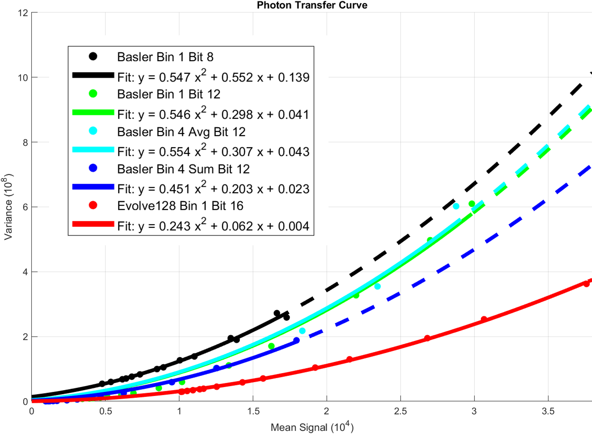
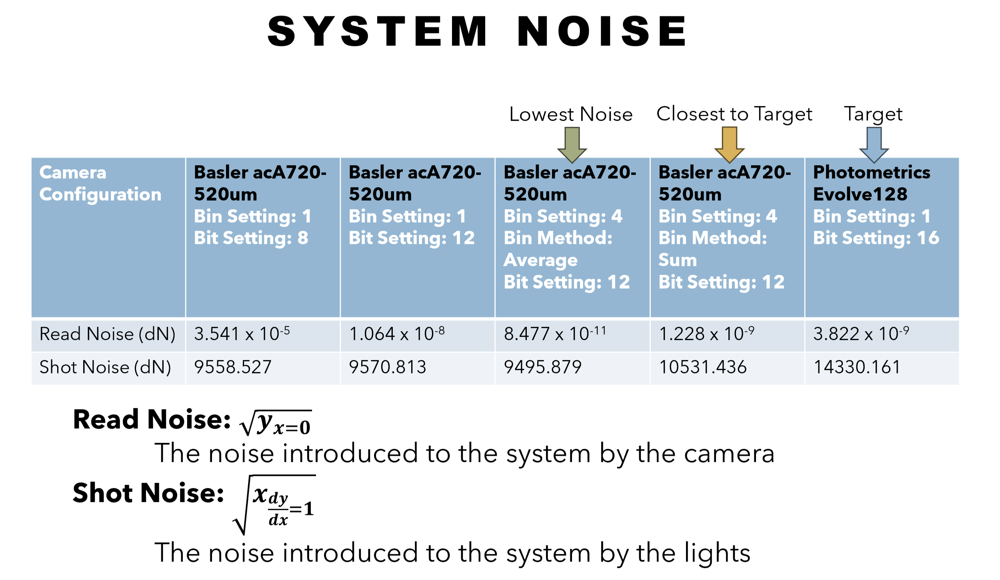

# Keela

Image Aquisition Program, Specializing in Cardiac Optical Mapping

Goal: Making High Quality Cardiac Optical Mapping Experiments Accessible

Makers:<br>
&nbsp;&nbsp;&nbsp;CHAOS Lab at Georgia Institute of Technology<br>
&nbsp;&nbsp;&nbsp;Atlanta, GA<br>
&nbsp;&nbsp;&nbsp;United States<br>

## Installation instructions

### Windows

- Download [Keela](https://github.com/Evan-Hartley/Keela)
- Install [MSYS2 MinGW](https://www.msys2.org/)
- Add mingw64 bin directory to PATH env variable (by default this will be C:\msys64\mingw64\bin)
- Open a mingw64 terminal via the windows search bar
- install the following dependencies via pacman: `$pacman -S <package-name>`
    - `mingw-w64-x86_64-pkg-config` (sometimes this is preinstalled with MSYS2 MinGW)
    - `mingw-w64-x86_64-toolchain`
    - `mingw-w64-x86_64-cmake`
    - `mingw-w64-x86_64-gtkmm3`
    - `mingw-w64-x86_64-gstreamer`
    - `mingw-w64-x86_64-gst-plugins-base`
    - `mingw-w64-x86_64-gst-plugins-good`
    - `mingw-w64-x86_64-gst-plugins-bad`
    - `mingw-w64-x86_64-gst-plugins-ugly`
    - `mingw-w64-x86_64-gst-libav`
    - `mingw-w64-x86_64-spdlog`
    - `mingw-w64-x86_64-aravis`
    - `mingw-w64-x86_64-aravis-gst`
    - `mingw-w64-x86_64-tbb`
- **(Optional)** if you like, in a fresh terminal, run the command `gst-inspect-1.0` to confirm gstreamer is installed
- run the following commands in the repository directory
    - `mkdir build && cd build`
    - `cmake .. -G ``MinGW Makefiles" -DCMAKE_BUILD_TYPE=Release`
    - `mingw32-make -j$(nproc)`

### Linux

- Install the equivalent dependencies in your package manager
    - `cmake`
    - `gtkmm3`
    - `gstreamer`
    - `gst-plugins-good`
    - `gst-plugins-bad`
    - `gst-plugins-ugly`
    - `build-essential`
    - `spdlog`
    - `libaravis-dev`
- Run the following commands in the repository directory
    - `mkdir build && cd build`
    - `cmake .. -DCMAKE_BUILD_TYPE=Release`
    - `make keela -j$(nproc)`

### Additional Linux Building Options

Build with custom `keela-videotestsrc` plugin enabled:

```
make gstkeelavideotestsrc
cmake .. -DENABLE_KEELA_VIDEOTESTSRC=ON
make keela -j$(nproc)
```

Note: Ideally the build step could build the plugin automatically, but I haven't figured that out yet.

To switch back to the default configuration (without the custom plugin):

```
cmake .. -DENABLE_KEELA_VIDEOTESTSRC=OFF
make keela -j$(nproc)
```

or:

```
make clean-config
cmake ..
make keela -j$(nproc)
```

## Porting Camera Driver Control to Keela

This is another process we are hoping to streamline in the future

- Download [Zadig](https://zadig.akeo.ie/)
    - Preferred version as of May 2026: Zadig 2.9
- Plug camera into the target computer
- Follow these steps to select a driver:
    - Select "Options" then "List All Devices"
    - In item drop down menu, select the target Aravis supporting Camera (our testing camera is the [Basler acA720-520um](https://www.baslerweb.com/en/shop/aca720-520um/))
        
    - Leave the current driver as detected, but change the new driver to `libusbK (v3.1.0.0)`
    - Click the "Install WCID Driver" Button (**Note:** if already installed, this button will instead read "Reinstall Driver")
    - **NOTE:** On the rare occassion that hte installation fails, just run through these steps again

# Camera Program Proceedure
- Plug in camera before program launch
- Navigate into the build directory, then into the keela-exe directory and launch the keela.exe file
- Adjust gain, exposure, and frequency to desired values, then restart the cameras to initiate changes (Recommended Exposure: $700 \\mu s$, Recommended Frequency: $500 Hz$)
- Select a bit depth for the gathered data, the restart cameras to initiate changes (**Note:** Check camera data sheet before inputting data aquisition bit depth - the Basler acA720-520um supports up to 12-bit data aquisition, with an 8-bit default)
- Select a binnning method and scale, then restart cameras to initiate changes (Recommended for Basler acA720-520um: Use the Sum Binning Style with a scale of 4 and lower your gain setting to prevent data saturation)
      
      
- Click the "Show Traces" Check Box
    - You can adjust the amount of seconds displayed on the trace feed (recorded data remains unaffected)
    - You can choose to reset the trace feed, so that your trace window clears and reinitalizes itself (recorded data remains unaffected)
    - Within the trace window you can invert the display of the traces as they are displayed to you (recorded data remains unaffected)
    - Within the trace window you can read the minimum and maximum values of the trace to know the amplutude of your signal
- Click and drag on the video feed to select a region of interest (ROI) for the trace to average over (**Note:** Original feed with no ROI is an overall average of the image)
- Select a directory (**Note:** You will be prompted to select a directory if you are attempting to record without having previously selected a directory)
- To record data select the "Begin Recording" button, this will then change to say "Recording" while the recording is in progress. To end the recording, select the same button.
    - All saved files are time sstamped at the beginning of the recording, so there will be no possibility of data overwrites
    - All files are saved during the recording process, so if the cameras crash in the middle of a recordingin, no data is lost
    - Files are saved as .mkv files and can be viewed immediately after recording using [VLC Media Player](https://www.videolan.org/vlc/download-windows.html). The metadata of the file will also display the dimensions of the video and the achieved framerate
    - To double check the directory you are recording to, hover over the "Select Directory" button
- To restart cameras (needed after some recordings), use the "Restart Cameras" button
- **Visualization Option:** Providing a Minimum and Maximum in the data visualization window changes the displayed video into a rainbow colored mode to help visualize the live data (recorded data remains unaffected)

# Developmental Bug Notes
- Upon exiting the main window there will be a prompt reminding the user to take calibration photos. Currently there is only the "OK" button option and no option to cancel the closing of the window, for now just click "OK" to dismiss the reminder and relaunch the program (double checking settings) if you need to take calibration photos (**Note:** - May 2026 - snapshot button currently not operational, take a short calibration video instead)
- During fast framerates, the video display can ocassionally lag, but the recordings are run through a seperate pipeline which has a seperate update frequency and does not experience this lag, so though the live feed may lag slightly, your recording will have consistency in its framerate
- The Calcium/Voltage Imaging Option does not currently have a way to be synchronized with a light source, so this option just cuts your frame rate in half at the moment, but the structure for this imaging technique is present and worth checking out. It splits both the video display and the traces. (Hardware schematics and software update in the works)
